# 05 — Page-by-Page Transcription

All 22 slides in order. Text is transcribed verbatim (light typo fixes noted). Where a slide has no live text, its visual content is described. The PDF outline names the source Illustrator file for each slide; these names are included because they reveal the deck's intended sequence (files 03 and 04 in the numbering were dropped or merged).

Slides 5 and 6 are lower resolution (720×405) than the rest (1920×1080), consistent with being imported from the Phase 1 Discovery deck. Their renders in `slides/` are upscaled and look soft.

Rendered slides (1280 px wide JPEG) are in the `slides/` folder and embedded below.

---

### Slide 1 — Cover
*Source: 00 IMC Fund Narrative Transition Cover*

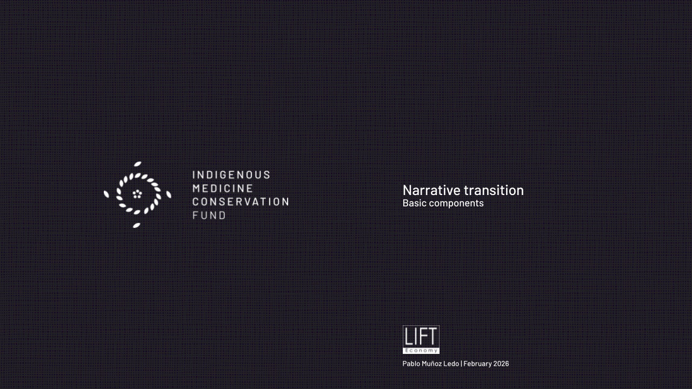

Dark purple-black woven texture background. White mark and four-line wordmark at left.

> Narrative transition
> Basic components
>
> [LIFT Economy logo]
> Pablo Muñoz Ledo | February 2026

---

### Slide 2 — Proposed logo evolution (mark)
*Source: 01 IMC Fund Narrative Transition Logo*

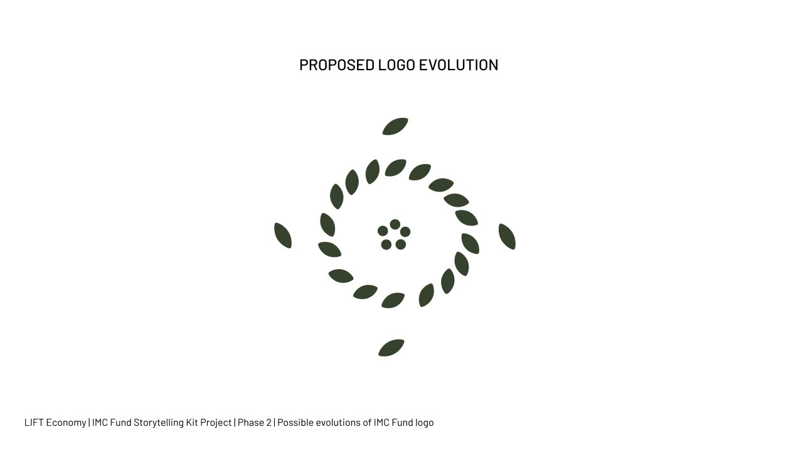

White background. Title: **PROPOSED LOGO EVOLUTION**. The mark alone, large, dark green: spiral of leaf shapes, five central dots, four outlying leaves.

Footer: *LIFT Economy | IMC Fund Storytelling Kit Project | Phase 2 | Possible evolutions of IMC Fund logo*

---

### Slide 3 — Proposed logo evolution (lockup)
*Source: 02 IMCF logo process (process 00–04)*

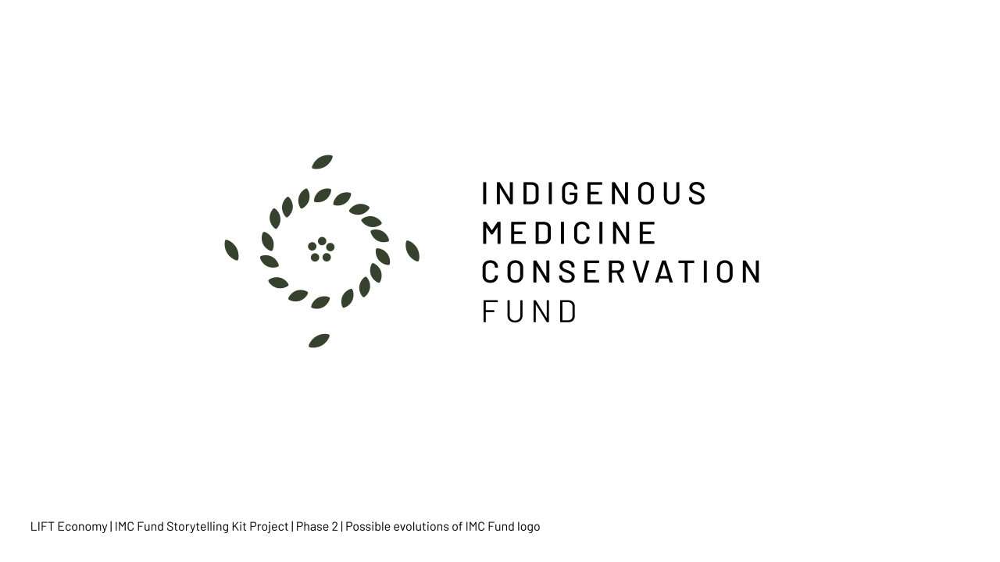

White background. Horizontal lockup: mark at left, four-line wide-tracked wordmark INDIGENOUS / MEDICINE / CONSERVATION / FUND at right.

Same footer as slide 2.

---

### Slide 4 — Discovery: Voices | Audiences
*Source: 05 IMC Fund Transition Discovery Recap*

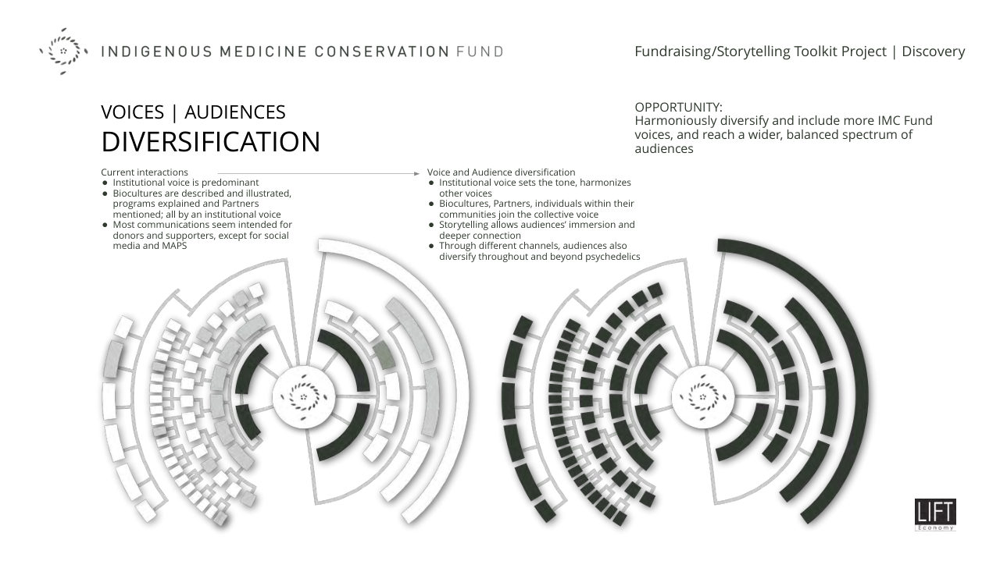

Header: one-line wordmark, left; *Fundraising/Storytelling Toolkit Project | Discovery*, right.

> **VOICES | AUDIENCES**
> **DIVERSIFICATION**
>
> Current interactions
> - Institutional voice is predominant
> - Biocultures are described and illustrated, programs explained and Partners mentioned; all by an institutional voice
> - Most communications seem intended for donors and supporters, except for social media and MAPS
>
> → Voice and Audience diversification
> - Institutional voice sets the tone, harmonizes other voices
> - Biocultures, Partners, individuals within their communities join the collective voice
> - Storytelling allows audiences' immersion and deeper connection
> - Through different channels, audiences also diversify throughout and beyond psychedelics
>
> OPPORTUNITY:
> Harmoniously diversify and include more IMC Fund voices, and reach a wider, balanced spectrum of audiences

Visual: two radial voice-map diagrams (current: mostly white/grey; desired: mostly filled dark). LIFT Economy logo bottom right.

---

### Slide 5 — Discovery: Visual Components
*Source: 06 IMC Fund Fundraising/Storytelling Toolkit, 1. Discovery final pages*

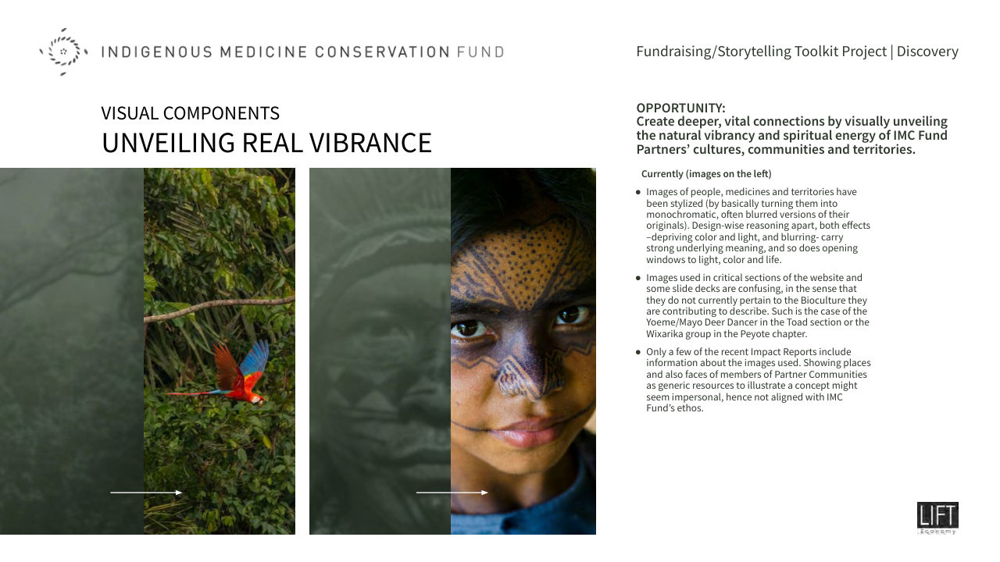

> **VISUAL COMPONENTS**
> **UNVEILING REAL VIBRANCE**
>
> OPPORTUNITY:
> Create deeper, vital connections by visually unveiling the natural vibrancy and spiritual energy of IMC Fund Partners' cultures, communities and territories.
>
> Currently (images on the left)
> - Images of people, medicines and territories have been stylized (by basically turning them into monochromatic, often blurred versions of their originals). Design-wise reasoning apart, both effects –depriving color and light, and blurring- carry strong underlying meaning, and so does opening windows to light, color and life.
> - Images used in critical sections of the website and some slide decks are confusing, in the sense that they do not currently pertain to the Bioculture they are contributing to describe. Such is the case of the Yoeme/Mayo Deer Dancer in the Toad section or the Wixarika group in the Peyote chapter.
> - Only a few of the recent Impact Reports include information about the images used. Showing places and also faces of members of Partner Communities as generic resources to illustrate a concept might seem impersonal, hence not aligned with IMC Fund's ethos.

Visual: two split images (macaw in rainforest; young person with facial paint), muted on the left half and full-color on the right half, with an arrow beneath each.

---

### Slide 6 — Discovery: Narrative Evolution
*Source: same as slide 5*

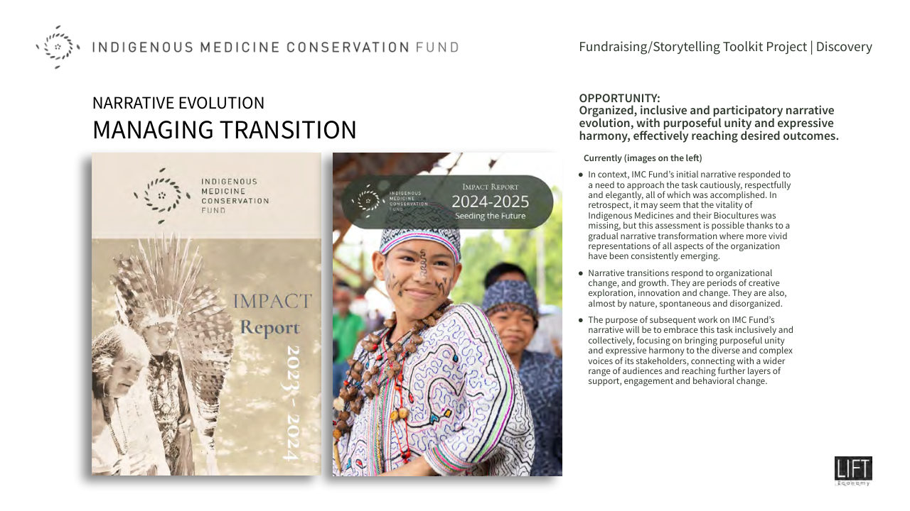

> **NARRATIVE EVOLUTION**
> **MANAGING TRANSITION**
>
> OPPORTUNITY:
> Organized, inclusive and participatory narrative evolution, with purposeful unity and expressive harmony, effectively reaching desired outcomes.
>
> Currently (images on the left)
> - In context, IMC Fund's initial narrative responded to a need to approach the task cautiously, respectfully and elegantly, all of which was accomplished. In retrospect, it may seem that the vitality of Indigenous Medicines and their Biocultures was missing, but this assessment is possible thanks to a gradual narrative transformation where more vivid representations of all aspects of the organization have been consistently emerging.
> - Narrative transitions respond to organizational change, and growth. They are periods of creative exploration, innovation and change. They are also, almost by nature, spontaneous and disorganized.
> - The purpose of subsequent work on IMC Fund's narrative will be to embrace this task inclusively and collectively, focusing on bringing purposeful unity and expressive harmony to the diverse and complex voices of its stakeholders, connecting with a wider range of audiences and reaching further layers of support, engagement and behavioral change.

Visual: Impact Report 2023–2024 cover (beige, monochrome) beside Impact Report 2024–2025 "Seeding the Future" cover (full-color portrait).

---

### Slide 7 — Harmonizing four tiers of IMC Fund Voices (diagram)
*Source: 07 IMC-Voices-diagram*

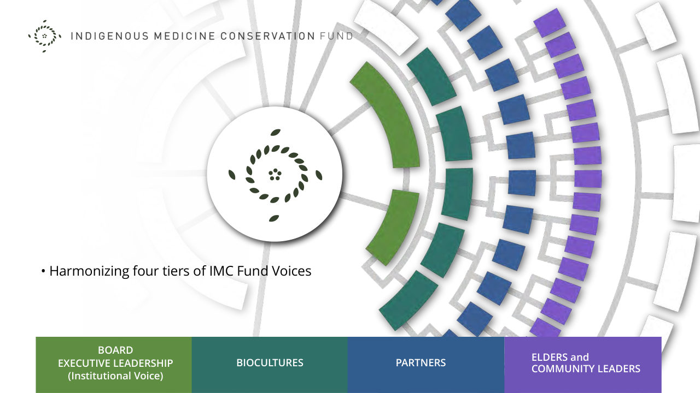

White background. Large radial diagram: IMC Fund mark in a white circle at centre-left; concentric arcs to the right in green (2 large segments), teal (ring of medium segments), blue (ring of small blocks), purple (ring of small blocks), then faint white arcs beyond. Grey connector lines join all blocks to the centre.

> • Harmonizing four tiers of IMC Fund Voices

Legend bar across the bottom:

| Green | Teal | Blue | Purple |
|---|---|---|---|
| BOARD / EXECUTIVE LEADERSHIP (Institutional Voice) | BIOCULTURES | PARTNERS | ELDERS and COMMUNITY LEADERS |

---

### Slide 8 — The Common Thread
*Source: 08 IMCF ST Common Thread 1 (and 09 Common Thread 2)*

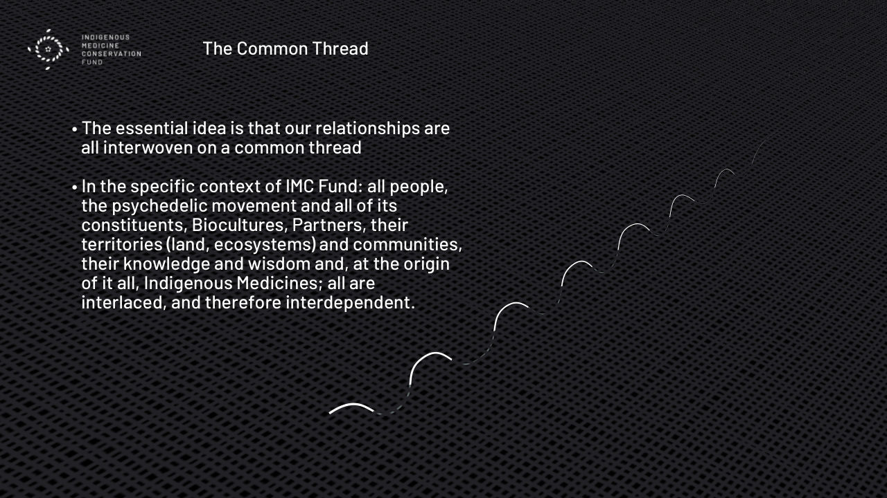

Dark woven texture. A white running-stitch line rises diagonally from lower-left to upper-right.

> **The Common Thread**
>
> - The essential idea is that our relationships are all interwoven on a common thread
> - In the specific context of IMC Fund: all people, the psychedelic movement and all of its constituents, Biocultures, Partners, their territories (land, ecosystems) and communities, their knowledge and wisdom and, at the origin of it all, Indigenous Medicines; all are interlaced, and therefore interdependent.

---

### Slide 9 — Textile-inspired Patterns
*Source: 10 IMCF ST Patterns System*

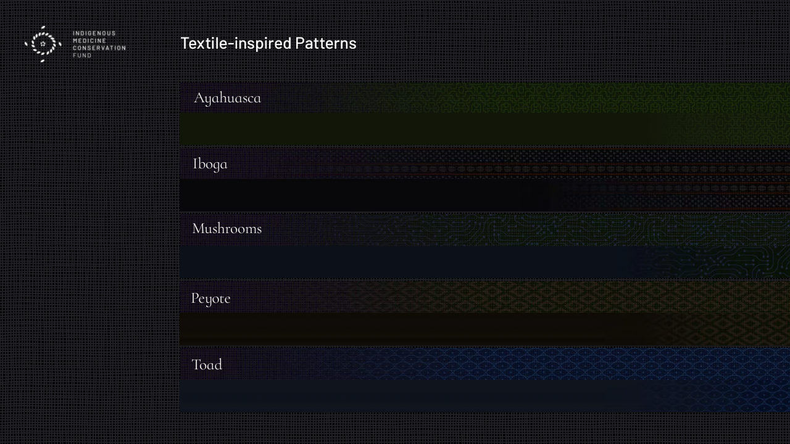

Dark texture. Title: **Textile-inspired Patterns**. Five horizontal strips, each labelled at left in a light serif: **Ayahuasca**, **Iboga**, **Mushrooms**, **Peyote**, **Toad**. Each strip blends from the plain common-thread texture (left) into the Bioculture pattern (right). See file 03 for pattern descriptions.

---

### Slide 10 — Patterns + color systems
*Source: 11 IMCF ST Patterns System+color*

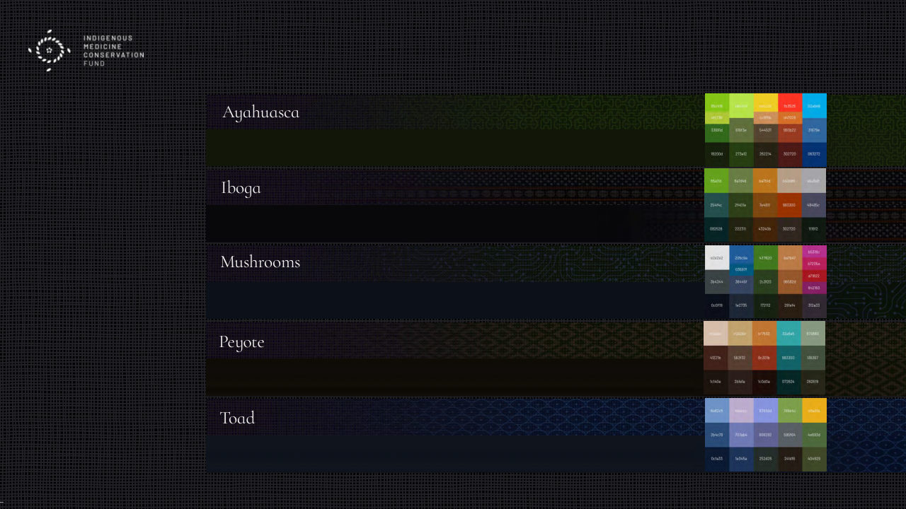

Same as slide 9 with a 5-column, 3-row hex-labelled palette added at the right of each strip (highlights / mid-tone / dark base). All values are tabulated in file 03. (The PDF's extractable text for the hex labels is garbled; values were read visually from an enlarged render.)

---

### Slide 11 — Harmonizing four tiers (system view)
*Source: 12 IMCF ST Thread flow*

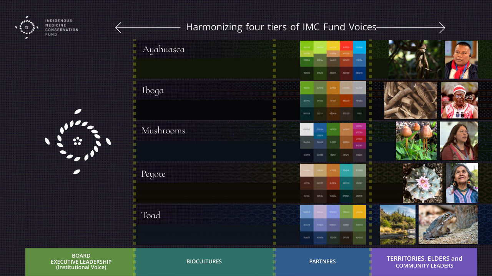

Dark texture. Title with double-headed arrow: **Harmonizing four tiers of IMC Fund Voices**. Large white mark at left. Five Bioculture rows, each showing: name + pattern strip | color palette | two photographs (medicine/territory, portrait). Dashed yellow-green vertical dividers. Legend bar across the bottom:

| Green | Teal | Blue | Purple |
|---|---|---|---|
| BOARD / EXECUTIVE LEADERSHIP (Institutional Voice) | BIOCULTURES | PARTNERS | TERRITORIES, ELDERS and COMMUNITY LEADERS |

---

### Slide 12 — How were textile-inspired patterns and color systems developed?
*Source: 13 Patterns-Color S Components*

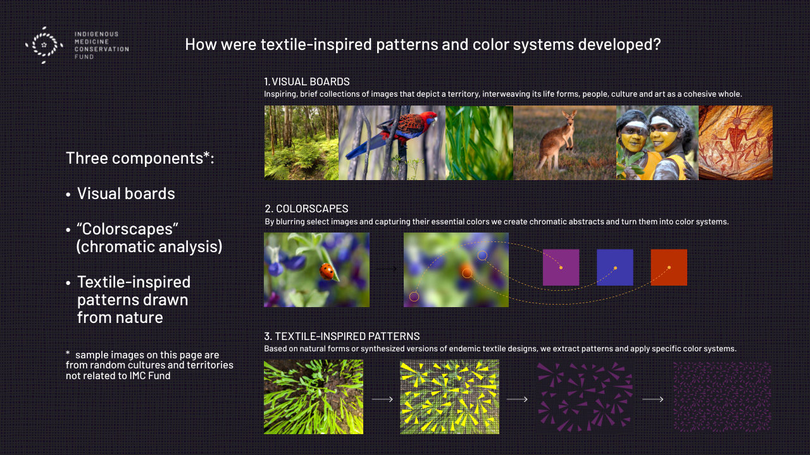

> **How were textile-inspired patterns and color systems developed?**
>
> Three components*:
> - Visual boards
> - "Colorscapes" (chromatic analysis)
> - Textile-inspired patterns drawn from nature
>
> \* sample images on this page are from random cultures and territories not related to IMC Fund
>
> **1. VISUAL BOARDS**
> Inspiring, brief collections of images that depict a territory, interweaving its life forms, people, culture and art as a cohesive whole.
>
> **2. COLORSCAPES**
> By blurring select images and capturing their essential colors we create chromatic abstracts and turn them into color systems.
>
> **3. TEXTILE-INSPIRED PATTERNS**
> Based on natural forms or synthesized versions of endemic textile designs, we extract patterns and apply specific color systems.

Visuals: (1) a six-image strip of one territory; (2) photo → blurred photo → three sampled swatches; (3) grass photo → traced strokes on grid → flat motif → dense repeat.

---

### Slides 13–17 — Thread + color-pattern blends
*Sources: 14–18 IMCF ST Thread+Color-Pattern blends (Ayahuasca, Iboga, Mushrooms, Peyote, Toad)*

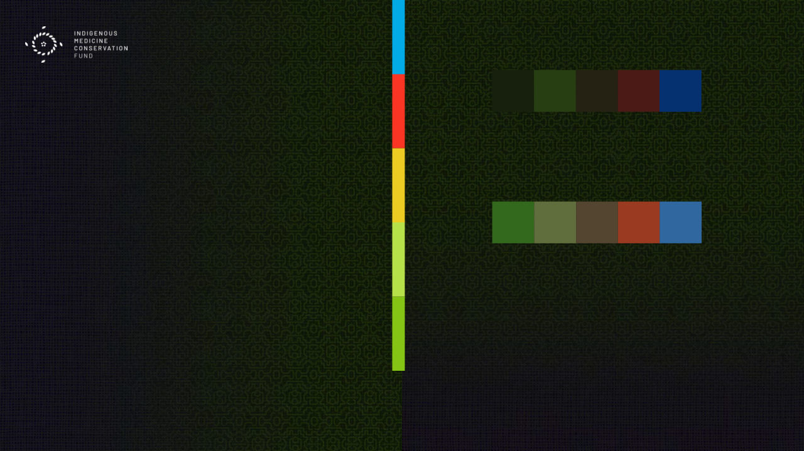
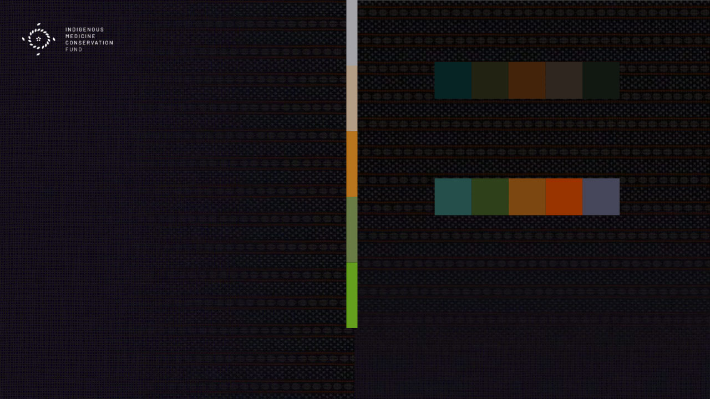
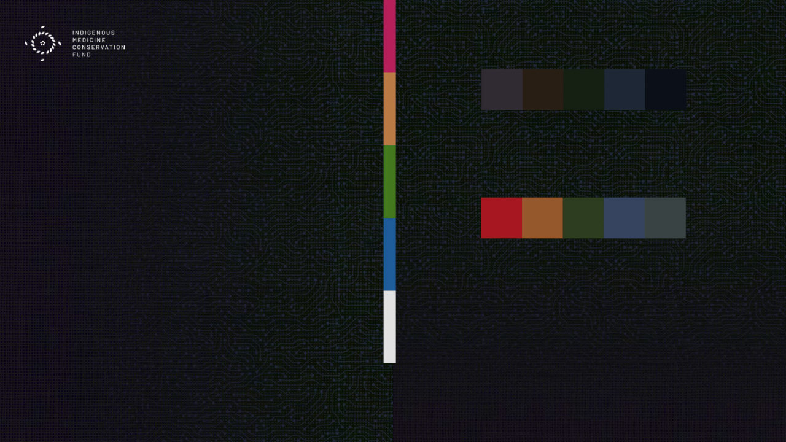
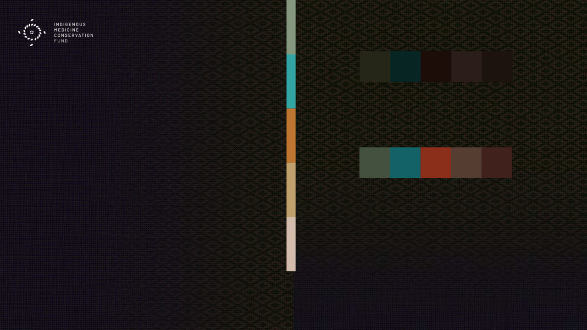
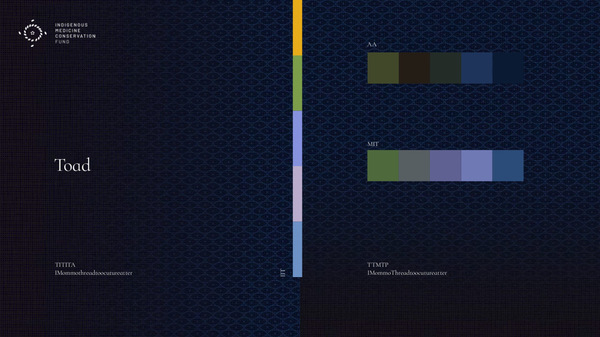

Identical layout per Bioculture: left half is a bottom-to-top blend from common thread into the Bioculture pattern; right half is a left-to-right blend; a five-segment vertical highlight bar at the centre seam; two 5-swatch strips (dark base, mid-tone) on the right.

Slides 13–16 have no text beyond the header mark. Slide 17 (Toad) carries the labels for the series:

> **Toad**
>
> BOTTOM-TOP BLEND
> IMCF Common Thread to Bioculture pattern
>
> LEFT-RIGHT HORIZONTAL BLEND
> IMCF Common thread to Bioculture pattern
>
> DARK, BASE COLORS
> MID-TONE COLORS
> HIGHLIGHTS

(In the rendered PDF these labels display with a broken font and appear as garbled serif text; the values above are from the PDF's text layer.)

---

### Slides 18–22 — Implementation examples
*Sources: 19–23 IMCF Implementation examples (AYA, IBO, MUSH, PEY, TOAD)*

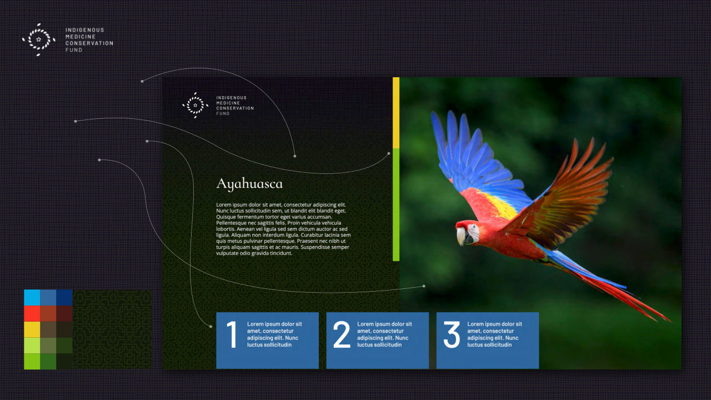
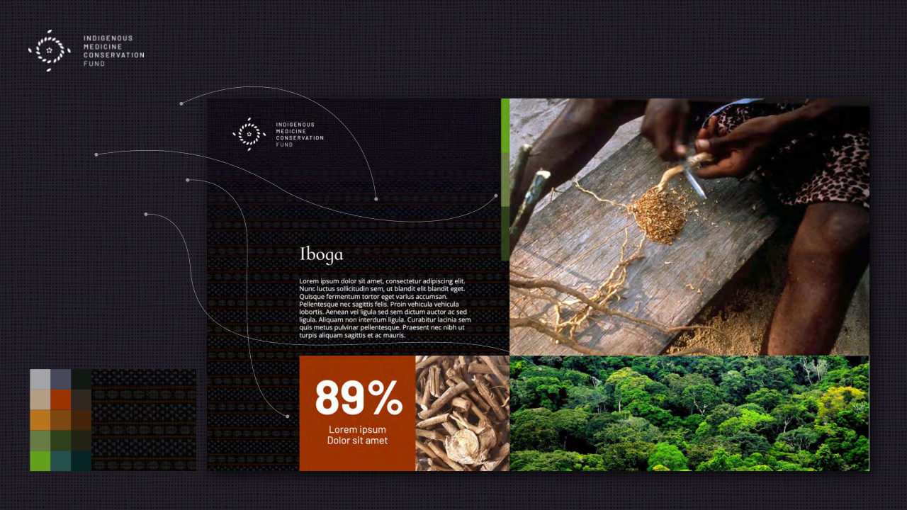
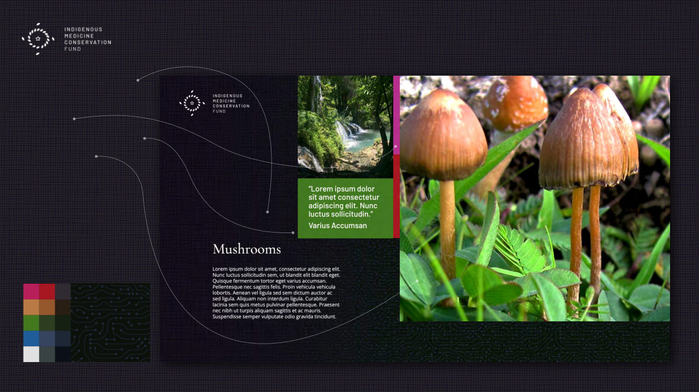
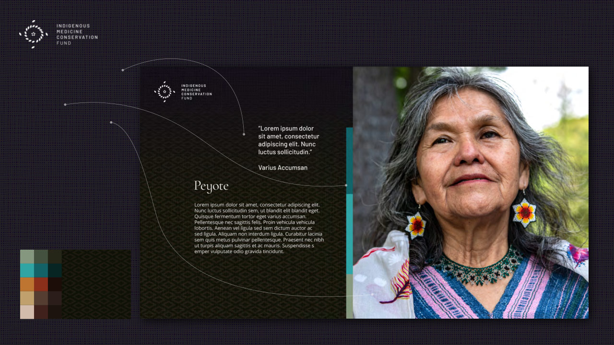
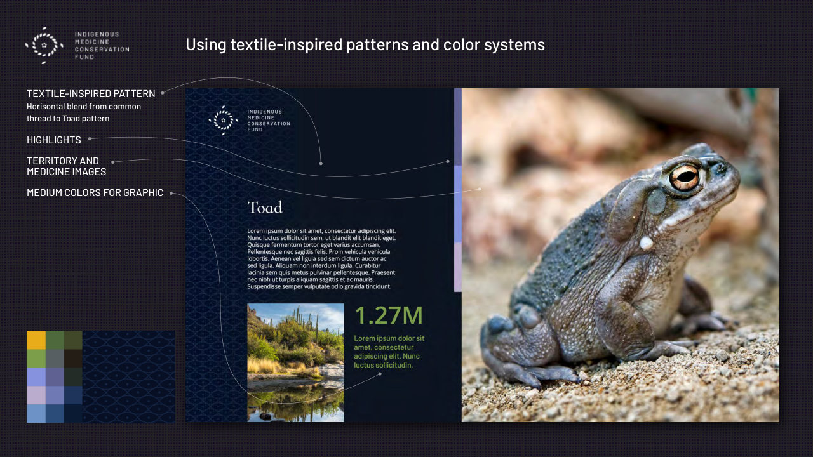

Each shows a mock 16:9 layout for one Bioculture with a small pattern + palette legend at bottom-left and thin annotation lines. Body text is Lorem ipsum. Slides 18–21 have no labels; slide 22 carries the labels for the series:

> **Using textile-inspired patterns and color systems**
>
> TEXTILE-INSPIRED PATTERN
> Horizontal blend from common thread to Toad pattern
>
> HIGHLIGHTS
>
> TERRITORY AND MEDICINE IMAGES
>
> MEDIUM COLORS FOR GRAPHIC

Per-slide content:

- **18 Ayahuasca** — macaw hero photo; three numbered blue cards.
- **19 Iboga** — root-bark scraping hero photo; "89%" burnt-orange stat card; bundled bark photo; aerial rainforest photo.
- **20 Mushrooms** — mushrooms hero photo; waterfall photo over a green quote card with attribution.
- **21 Peyote** — elder portrait hero photo; quotation set directly on the pattern.
- **22 Toad** — Sonoran desert toad hero photo; desert-wash portrait photo; "1.27M" statistic in green.

Full anatomy in file 04.

---

### Outline entry with no slide
*Source: 24 IMC Fund Narrative Transition End*

The PDF outline lists an "End" file but it resolves to page 1; no closing slide is present in the export.
